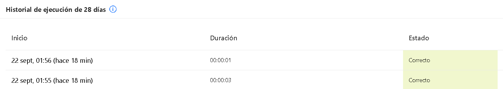
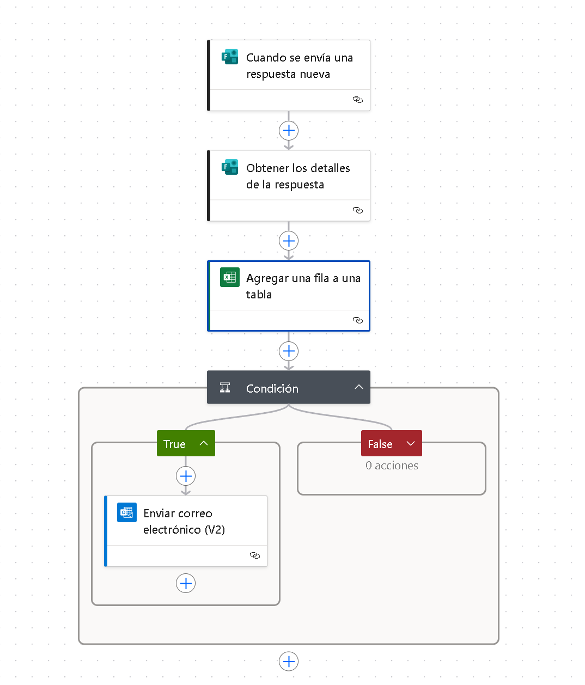
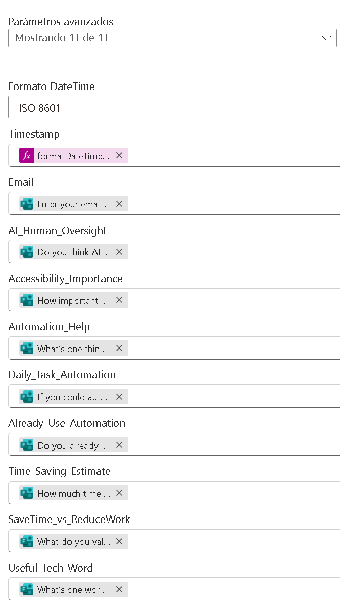
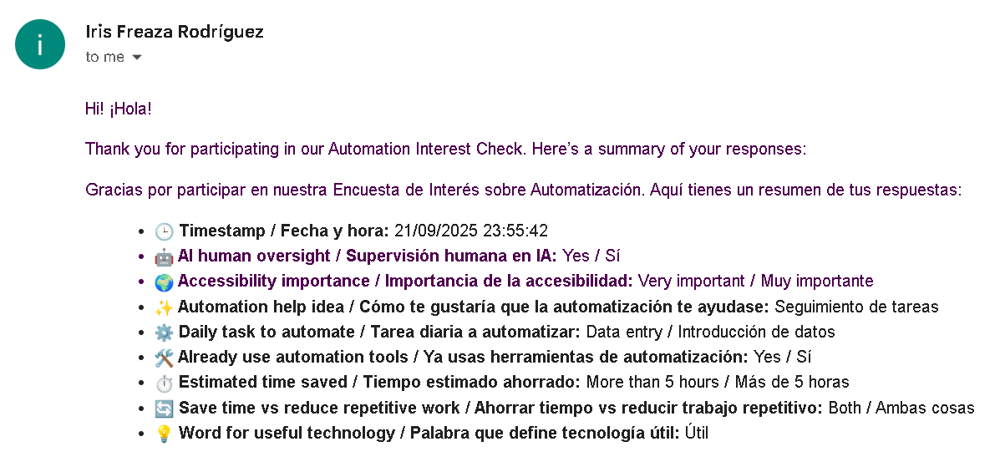

# Automation Interest Check

Gathering insights from users to design human-centered and ethical automation solutions.  

---

## About the project

This Power Automate project collects responses from a custom Microsoft Forms survey and stores them in Excel.  
It also sends a confirmation email with the responses, providing immediate feedback to participants.  

---

## How it works

- 📝 **Trigger** When a response is submitted in Microsoft Forms 
- 💾 **Save responses** Automatically store them in an Excel table 
- ✉️ **Confirmation email** Optional email to participants with their responses
- 📊 **Organized data** Keep responses structured for analysis and visualization 

---

## Screenshots

  

<small><i>The flow ran successfully and was approved</i></small>

 

  

<small><i>Overview of the full automation flow for the project</i></small>

 

<small><i>Parameters configured for the "Add a row to a table" activity in Excel</i></small>

 

<small><i>Snapshot of the Excel file where user responses are stored</i></small>

 

  

<small><i>Body of the email a user receives when they request to see their responses</i></small>

---

## What I learned

- Working with Microsoft Forms and Excel integration
- Automating user notifications via email 
- Handling data cleanly and securely
- Applying human-centered design principles in automation

---

## Let's connect!

Developed by <a href="https://github.com/reinarins">@reinarins</a>
 
RPA Developer | UiPath | Digital innovation from a human and ethical perspective
 
Feel free to connect on <a href="https://www.linkedin.com/in/irisfrro/">LinkedIn</a>!
